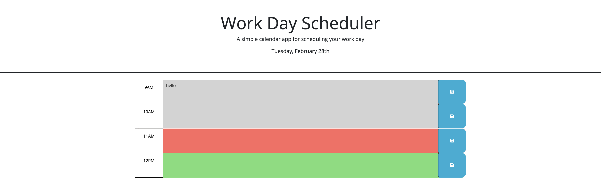

# Work-Day-Scheduler
A calendar that tracks your schedule during the work day

## Description
This work schedule website was made to track your schedule during the work day. It contains time blocks from 9am-5pm and allows you to enter information during each hour period. The layout of the site is built using a combination of bootstrap and CSS. Meanwhile, the functionality is built using Javascript and jQuery.

## Installation
N/A

## Usage
This work day schedule has a simple design with a header at the top that displays the title and date. 

Below the title is the actual work schedule calendar. It contains time blocks from 9am-5pm to account for the typical work day. Within each time block, there is a text box and a save button. If you enter information into the text box and hit the save button that corresponds to the text box, then that text will be saved into local storage. That means you can refresh the webpage and still see this saved information. In the below picture, "hello" has been entered into the 9am time block and is saved to local storage.

One final feature of this website is the color-coded time blocks. In this instance, a gray background means that this time-period is in the past; a red background means this time period is in the present; and a green background means the time-period is in the future. In the above picture, you will notice that 11am is in red. This is because the picture was taken at approximately 11:10am. Once the clock shifts to 12pm, then the 11am time block will become gray and the 12pm time block will turn red. All of the times after 12pm will still be green since they are still in the "future". 

Below is a link to the active website:

https://jacone626.github.io/work-day-scheduler/

## Credits
https://stackoverflow.com/questions/15397372/javascript-new-date-ordinal-st-nd-rd-th

## License
Please refer to the license in the repo.